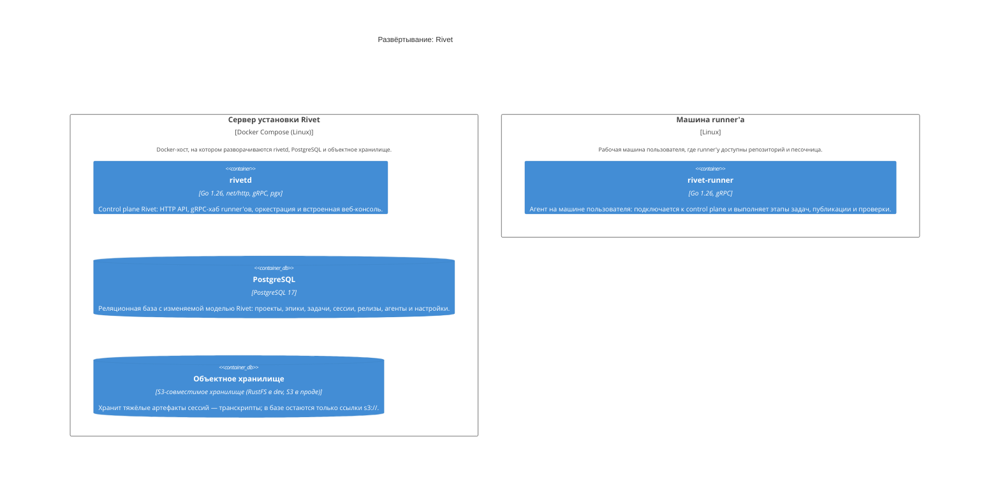

<!-- Сгенерировано командой rivet architecture views. Не редактируй вручную: файл перезаписывается. -->

# Развёртывание: Rivet

- [Контекст](context.md)

```mermaid
C4Deployment
  title Развёртывание: Rivet
  Deployment_Node(n_tech_node_plane, "Сервер установки Rivet", "Docker Compose (Linux)", "Docker-хост, на котором разворачиваются rivetd, PostgreSQL и объектное хранилище.") {
    Container(n_inst_tech_node_plane_app_rivetd, "rivetd", "Go 1.26, net/http, gRPC, pgx", "Control plane Rivet: HTTP API, gRPC-хаб runner'ов, оркестрация и встроенная веб-консоль.")
    ContainerDb(n_inst_tech_node_plane_tech_postgres, "PostgreSQL", "PostgreSQL 17", "Реляционная база с изменяемой моделью Rivet: проекты, эпики, задачи, сессии, релизы, агенты и настройки.")
    ContainerDb(n_inst_tech_node_plane_tech_s3, "Объектное хранилище", "S3-совместимое хранилище (RustFS в dev, S3 в проде)", "Хранит тяжёлые артефакты сессий — транскрипты; в базе остаются только ссылки s3://.")
  }
  Deployment_Node(n_tech_node_runner, "Машина runner'а", "Linux", "Рабочая машина пользователя, где runner'у доступны репозиторий и песочница.") {
    Container(n_inst_tech_node_runner_app_runner, "rivet-runner", "Go 1.26, gRPC", "Агент на машине пользователя: подключается к control plane и выполняет этапы задач, публикации и проверки.")
  }
```
