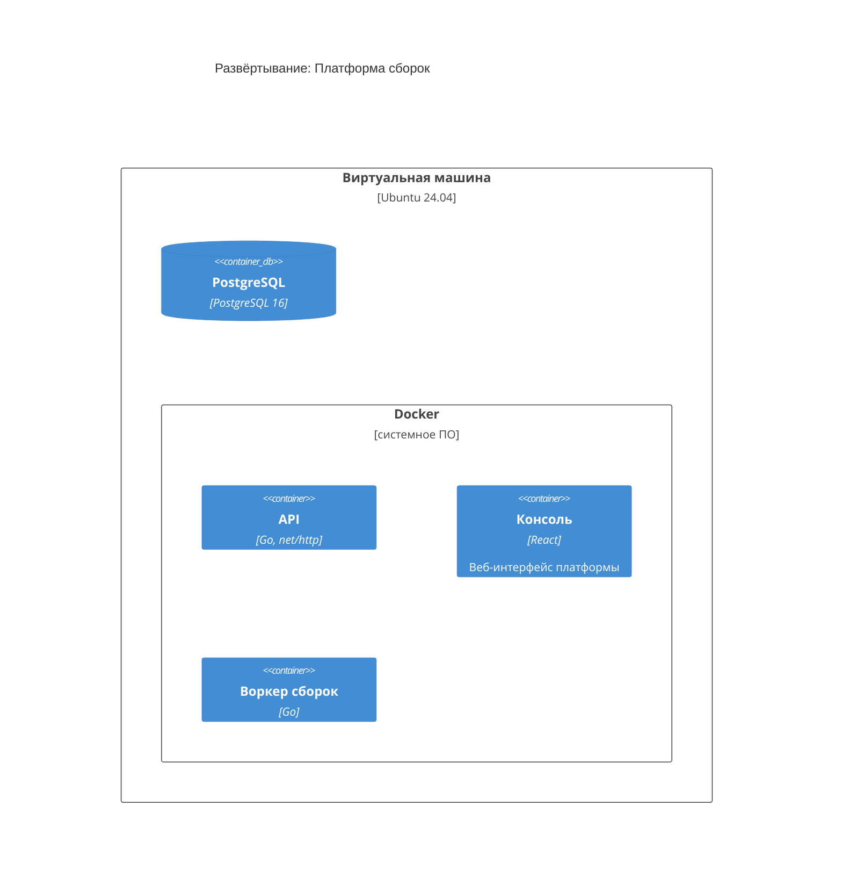

<!-- Сгенерировано командой rivet architecture views. Не редактируй вручную: файл перезаписывается. -->

# Развёртывание: Платформа сборок

- [Контекст](context.md)

```mermaid
C4Deployment
  title Развёртывание: Платформа сборок
  Deployment_Node(n_tech_vm, "Виртуальная машина", "Ubuntu 24.04", "") {
    Deployment_Node(n_tech_docker, "Docker", "системное ПО", "") {
      Container(n_inst_tech_docker_app_api, "API", "Go, net/http", "")
      Container(n_inst_tech_docker_app_web, "Консоль", "React", "Веб-интерфейс платформы")
      Container(n_inst_tech_docker_app_worker, "Воркер сборок", "Go", "")
    }
    ContainerDb(n_inst_tech_vm_tech_postgres, "PostgreSQL", "PostgreSQL 16", "")
  }
```
