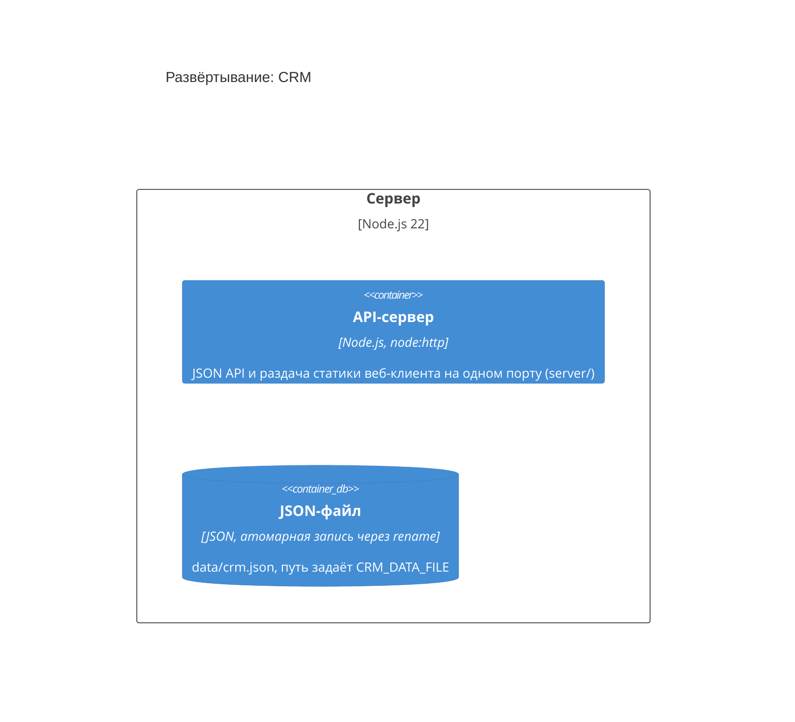

<!-- Сгенерировано командой rivet architecture views. Не редактируй вручную: файл перезаписывается. -->

# Развёртывание: CRM

- [Контекст](context.md)

```mermaid
C4Deployment
  title Развёртывание: CRM
  Deployment_Node(n_tech_host, "Сервер", "Node.js 22", "") {
    Container(n_inst_tech_host_app_api, "API-сервер", "Node.js, node:http", "JSON API и раздача статики веб-клиента на одном порту (server/)")
    ContainerDb(n_inst_tech_host_tech_json_file, "JSON-файл", "JSON, атомарная запись через rename", "data/crm.json, путь задаёт CRM_DATA_FILE")
  }
```
