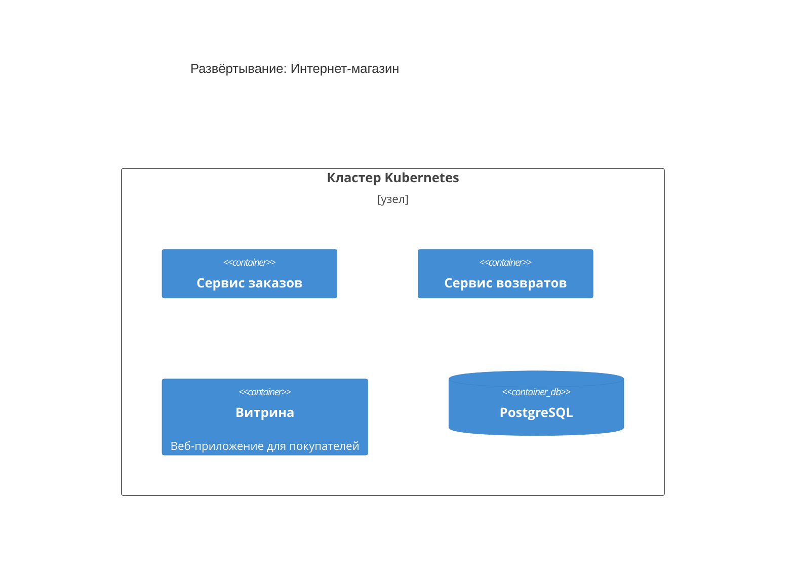

<!-- Сгенерировано командой rivet architecture views. Не редактируй вручную: файл перезаписывается. -->

# Развёртывание: Интернет-магазин

- [Контекст](context.md)

```mermaid
C4Deployment
  title Развёртывание: Интернет-магазин
  Deployment_Node(n_tech_k8s, "Кластер Kubernetes", "узел", "") {
    Container(n_inst_tech_k8s_app_orders, "Сервис заказов", "", "")
    Container(n_inst_tech_k8s_app_refunds, "Сервис возвратов", "", "")
    Container(n_inst_tech_k8s_app_storefront, "Витрина", "", "Веб-приложение для покупателей")
    ContainerDb(n_inst_tech_k8s_tech_postgres, "PostgreSQL", "", "")
  }
```
